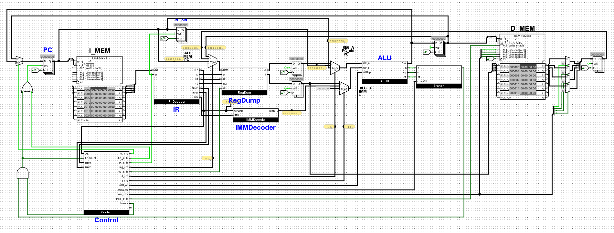
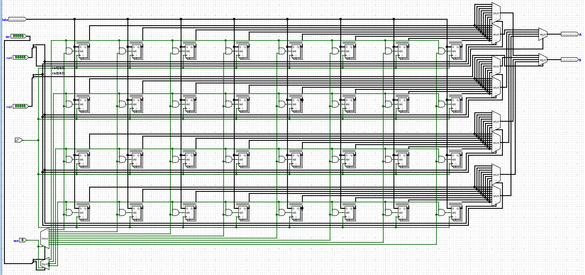
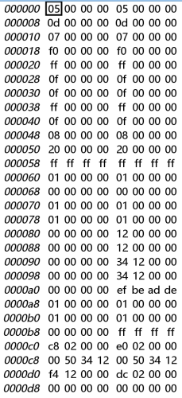

# RISC-V 仿真项目 (RV32I)

## 项目简介
本项目是一个基于 RISC-V 指令集架构 (RV32I) 的仿真程序，包含以下内容：
- **Logisim 项目文件**：`riscv_project.circ`，用于电路仿真。
- **源代码**：`prog.bin`，存放相关测试代码。
- **机器码设计**：`design.md`，基本实现RV32I中的指令。
- **微程序存储器**：`ctrl.bin`,`immc.bin`，分别对应控制器、立即数解码器中的ROM存储的微指令。

## 文件结构
```
├── prog.bin             # 测试代码
├── riscv_project.circ   # Logisim 项目文件
├── ctrl.bin             # 控制器ROM微指令
├── immc.bin             # 立即数解码器ROM微指令
├── design.md            # 设计文档
└── README.md            # 项目说明文件
```

## 使用说明

### 环境要求
- **Logisim-evolution**：用于打开和运行 `.circ` 文件。
- **RISC-V 汇编工具链**：如 `riscv-gnu-toolchain`，用于自行编写riscv并转成机器码测试。

### 运行步骤
**Logisim 仿真**：
   - 打开 `riscv_project.circ` 文件。
   - 导入`prog.bin`或其他riscv机器码。
   - 运行电路仿真，观察内存和寄存器堆数值变化。

## 示范图







## 贡献指南
欢迎对本项目提出改进建议或提交代码贡献：
1. Fork 本仓库。
2. 创建新分支：
   ```bash
   git checkout -b feature/your-feature
   ```
3. 提交更改并推送：
   ```bash
   git commit -m "描述你的更改"
   git push origin feature/your-feature
   ```
4. 提交 Pull Request。

## 许可证
本项目遵循 [MIT 许可证](LICENSE)。

## 联系方式
如有任何问题，请通过以下方式联系我：
- GitHub Issues